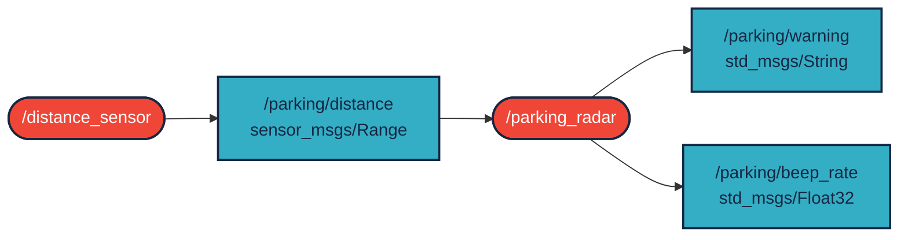
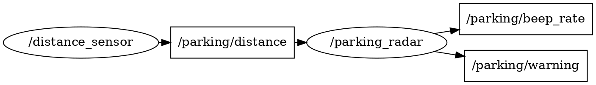

# `kle_g26_parkingradar` package

Szimulált tolatóradar ROS 2 alatt. Egy autó tolat egy fal felé, a hátsó ultrahangos szenzor méri a távolságot, a radar pedig a távolság alapján figyelmeztet – mint egy valódi parkolóradar. Megvalósítás `ROS 2 Humble` alatt.

A package két node-ból áll:

- A `/distance_sensor` 10 Hz-en szimulált távolságot hirdet egy `sensor_msgs/msg/Range` típusú topicban (`/parking/distance`). A távolság 2.0 m-ről 0.1 m-ig csökken (0.2 m/s tolatás), utána újraindul; az értékhez kis zajt ad.
- A `/parking_radar` feliratkozik a távolságra, és két topicot hirdet: a figyelmeztetési szintet `std_msgs/msg/String` típusban (`/parking/warning`), a sípolás frekvenciáját `std_msgs/msg/Float32` típusban (`/parking/beep_rate`).

| Távolság | `/parking/warning` | `/parking/beep_rate` |
|---|---|---|
| > 1.5 m | `BIZTONSAGOS` | 0 Hz |
| 0.8 – 1.5 m | `FIGYELEM` | 2 Hz |
| 0.3 – 0.8 m | `VESZELY` | 5 Hz |
| < 0.3 m | `STOP!` | 20 Hz |

## Node-topic kapcsolatok



Futás közben az `rqt_graph` által mutatott gráf:



## Packages and build

It is assumed that the workspace is `~/ros2_ws/`.

### Clone the packages

```bash
cd ~/ros2_ws/src
```

```bash
git clone https://github.com/Vikesz-g2662b/kle_g26_parkingradar
```

### Build ROS 2 packages

```bash
cd ~/ros2_ws
```

```bash
colcon build --packages-select kle_g26_parkingradar --symlink-install
```

## Run

```bash
source ~/ros2_ws/install/setup.bash
```

```bash
ros2 launch kle_g26_parkingradar parking_radar.launch.py
```

A figyelmeztetések külön terminálban is megnézhetők:

```bash
ros2 topic echo /parking/warning
```

Példa kimenet:

```
[parking_radar-2] [INFO] [parking_radar]: Tolatoradar elindult
[parking_radar-2] [INFO] [parking_radar]: Tavolsag: 1.97 m -> BIZTONSAGOS (sipolas: 0 Hz)
[parking_radar-2] [INFO] [parking_radar]: Tavolsag: 1.49 m -> FIGYELEM (sipolas: 2 Hz)
[parking_radar-2] [INFO] [parking_radar]: Tavolsag: 0.80 m -> VESZELY (sipolas: 5 Hz)
[parking_radar-2] [INFO] [parking_radar]: Tavolsag: 0.29 m -> STOP! (sipolas: 20 Hz)
[distance_sensor-1] [INFO] [distance_sensor]: Uj parkolas indul 2.0 m-rol
```
